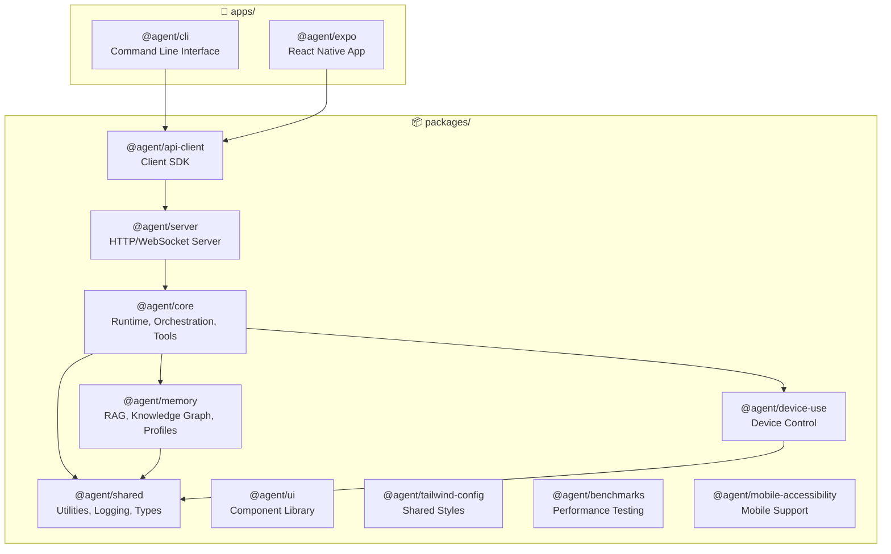
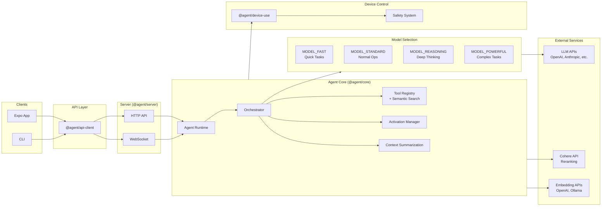
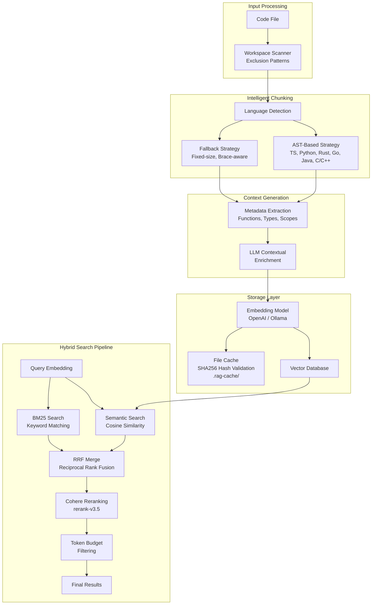
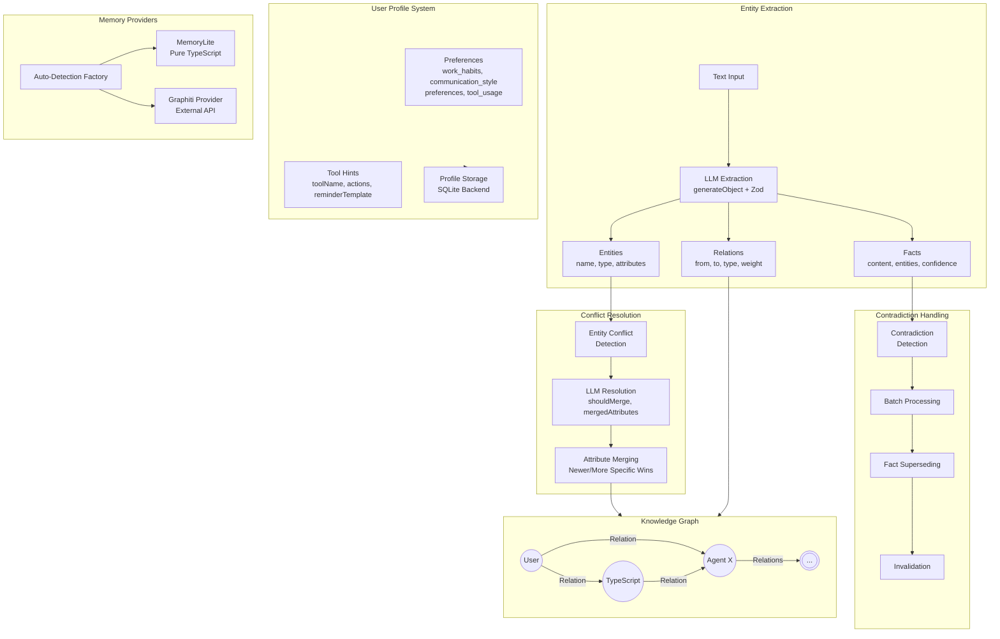
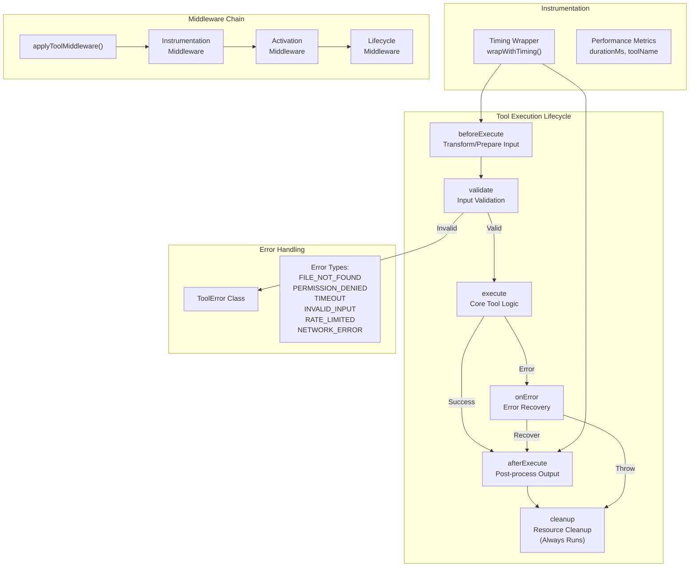
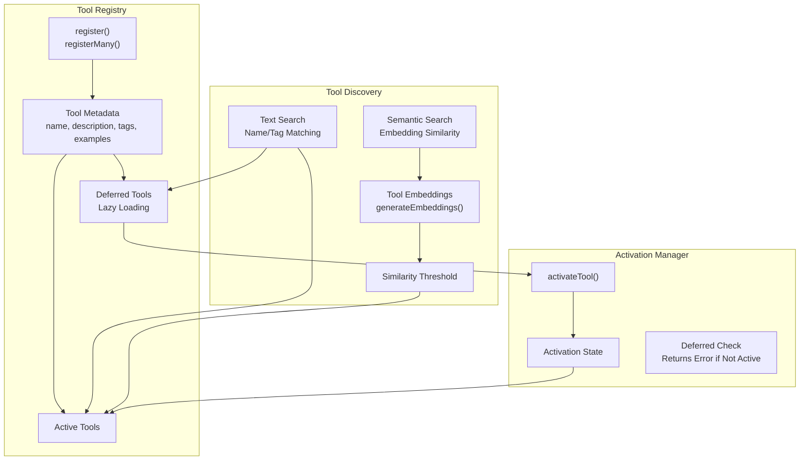
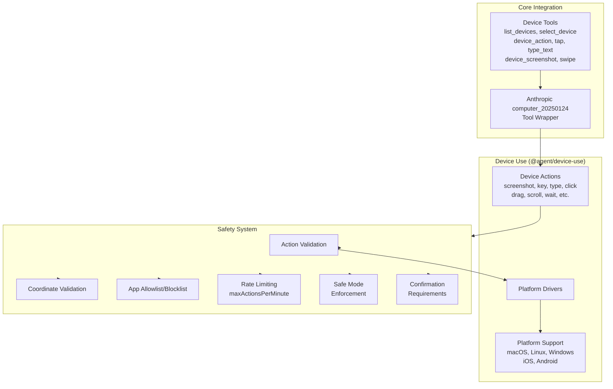
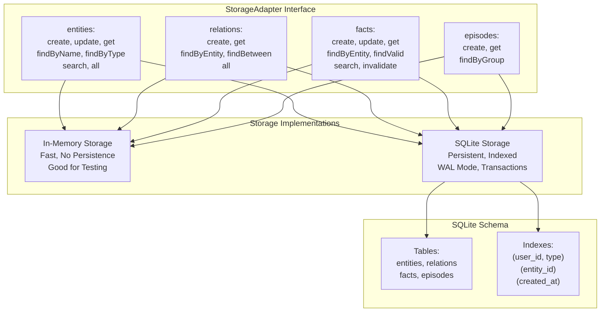
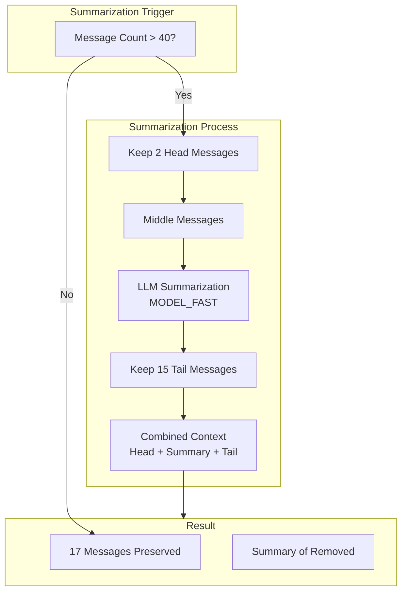
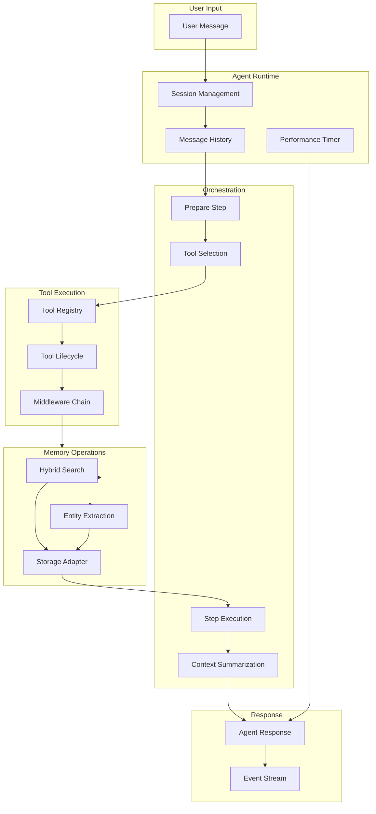

# Agent Platform Architecture

> Complete architecture documentation reflecting the actual codebase implementation

## Monorepo Structure



## System Architecture



## Memory System & RAG Pipeline



## Knowledge Graph & User Profile



## Tool Lifecycle



## Tool Registry & Discovery



## Device Control & Safety



## Storage Adapter Layer



## Context Summarization Flow



## Complete Data Flow



## Environment Configuration

```
┌─────────────────────────────────────────────────────────────┐
│                  Environment Variables                       │
├─────────────────────────────────────────────────────────────┤
│  EMBEDDING                                                   │
│  ├── OPENAI_EMBEDDING_MODEL=text-embedding-3-small          │
│  ├── OLLAMA_ENABLED=false                                   │
│  └── OLLAMA_BASE_URL=http://localhost:11434/api             │
│                                                              │
│  MODELS                                                      │
│  ├── MODEL_FAST=deepseek/deepseek-chat-v3-0324:free         │
│  ├── MODEL_STANDARD=google/gemini-2.0-flash-001             │
│  ├── MODEL_REASONING=deepseek/deepseek-r1:free              │
│  └── MODEL_POWERFUL=anthropic/claude-sonnet-4               │
│                                                              │
│  STORAGE                                                     │
│  ├── MEMORY_DB_PATH=./memory.db                             │
│  └── GRAPHITI_URL=undefined                                  │
│                                                              │
│  RAG OPTIONS                                                 │
│  ├── enableCache=true                                       │
│  ├── enableContextGeneration=true                           │
│  ├── enableBM25=true                                        │
│  ├── enableReranking=true                                   │
│  ├── rerankTopN=100                                         │
│  ├── returnTopN=8                                           │
│  └── maxTokensPerSearch=configurable                        │
└─────────────────────────────────────────────────────────────┘
```

## Core Tools Registered

```
┌─────────────────────────────────────────────────────────────┐
│                    Registered Core Tools                     │
├─────────────────────────────────────────────────────────────┤
│  FILE SYSTEM           │  AGENT                              │
│  ├── fs                │  ├── delegate                       │
│  └── shell             │  ├── task                           │
│                        │  ├── plan                           │
│  WEB                   │  ├── sequential_thinking            │
│  └── web               │  ├── ask_user                       │
│                        │  └── task_complete                  │
│  MEMORY                │                                     │
│  └── memory            │  DEVICE                             │
│                        │  ├── list_devices                   │
│                        │  ├── select_device                  │
│                        │  ├── device_action                  │
│                        │  ├── tap                            │
│                        │  ├── type_text                      │
│                        │  ├── device_screenshot              │
│                        │  └── swipe                          │
└─────────────────────────────────────────────────────────────┘
```
